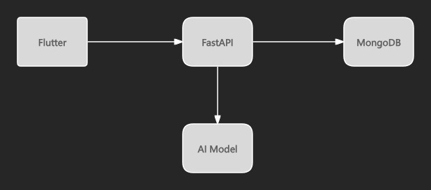
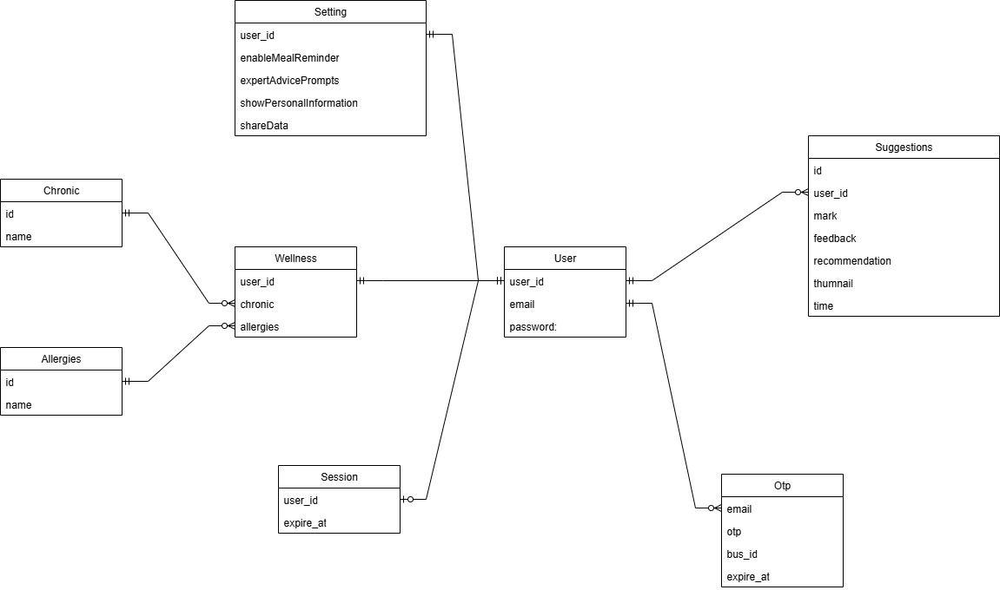
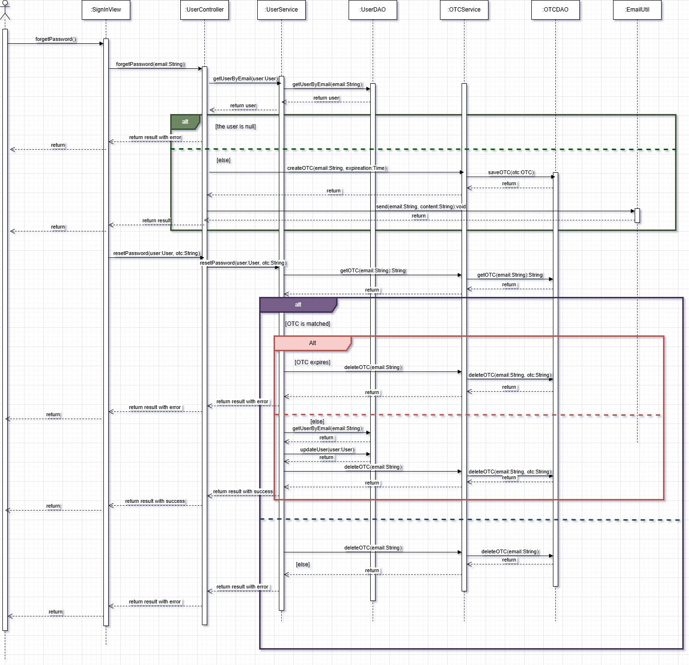
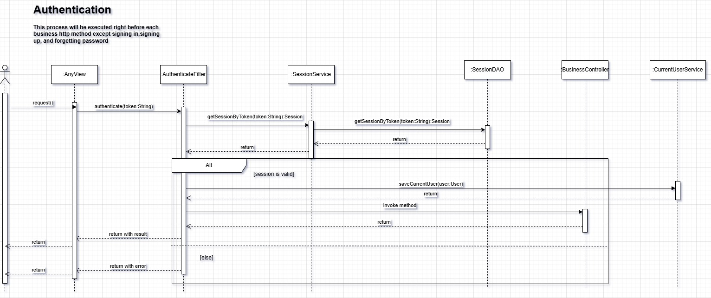
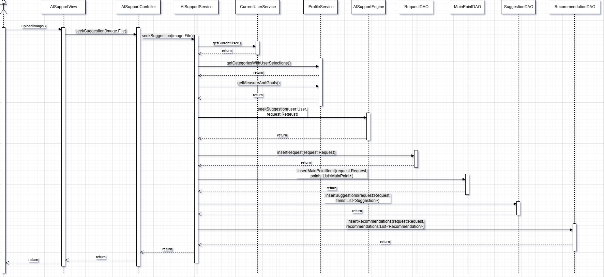

# Nutri Pilot – AI-powered Nutrition Planning Platform

Nutri Pilot is a capstone project developed under faculty supervision as part of my program, with iterative feedback from a project client.

The goal of the project was to build a nutrition planning application that integrates user health profiles and AI-generated suggestions. Throughout the project, requirements evolved based on client feedback, which led to multiple design and implementation iterations.

I was responsible for implementing the backend services and frontend application, as well as participating in system design discussions guided by instructors. Through this project, I gained hands-on experience with REST API development, authentication flows, database modeling, and containerized deployment.

This capstone project helped me understand how system design decisions are influenced by real requirements, feedback, and practical constraints, rather than purely theoretical considerations.

## Demos

- Live Demo: https://www.youtube.com/watch?v=PpI3tH1lzD8 (YouTube walkthrough, 3min)
- GitHub Repo: 
  - https://github.com/tiewang0913/nutri_pilot_frontend.git
  - https://github.com/tiewang0913/nutri_pilot_backend.git

## Tech Stack

The following technologies were selected and applied as part of the capstone project requirements and instructional guidance.

| Layer | Technology |
|------|------------|
| Backend | FastAPI (async)|
| Database | MongoDB |
| Frontend | Flutter |
| Deployment | Docker Compose |
| AI Model | ChatGPT 4o-mini|

## System Architecture

## Unified Domain Model (Conceptual Design – Capstone Scope)

This diagram represents the core business entities of Nutri Pilot and how they collaborate to support authentication, password recovery, and AI-powered nutrition
advice generation. Rather than focusing on physical database design, the model captures the essential domain concepts that drive the current MVP.

### Design Highlights

This domain model was created during the capstone design phase to help clarify core business concepts, with feedback and refinement guided by instructors.

- **User** is the central aggregate root, representing account identity and linking to all security, wellness, and AI-generated data.
- **Wellness** encapsulates the user’s health context and aggregates structured medical information such as **Chronic** conditions and **Allergies**, allowing the health profile to evolve without impacting core user data.
- **Session** and **OTP** are modeled as independent security entities to clearly separate authentication state and one-time verification flows.
- **Suggestions** represents persisted AI advice records, forming the final output of the AI interaction pipeline.

This unified domain model serves as the foundation for all critical workflows, including authentication, password recovery, and AI-powered nutrition guidance.

## Core System Workflow

Before implementation, key system workflows were designed as part of the capstone planning process to address security and reliability concerns discussed during instruction.

### 1. Reset Password – Secure Identity Recovery

**Why this matters**

These considerations were addressed to align with secure authentication practices introduced during the capstone course.

- Prevents user enumeration attacks  
- OTP is single-use and deleted immediately after validation  
- Expired OTP is cleaned up automatically to avoid replay attacks  

---

### 2. Authentication Filter – Centralized Trust Boundary

**Why this matters**

These design considerations were discussed and applied as part of the capstone course to reinforce secure and reliable system design principles.

- Authentication logic is decoupled from business controllers  
- All protected endpoints share a single trust boundary  
- Invalid sessions never reach business logic  

---

### 3. Getting Advice from AI – Core Business Pipeline

**Why this matters**

- Isolates AI inference from user request lifecycle  
- Enables async execution and future queue-based scaling  
- Allows caching of generated advice for cost optimization

## Key Engineering Challenges

These challenges were encountered and addressed during the capstone implementation phase, where design decisions were influenced by instructional guidance, project constraints, and client feedback.

### Context Handling in AI Interaction

Nutri Pilot does not maintain long-lived AI sessions.

Instead, only the user’s chronic conditions and allergy information are stored as structured fields in the database. When the user submits a food image, these fields are sent together with the image to the AI model. This avoids keeping long conversational context in memory and keeps the backend stateless.

### Image Handling Strategy

When a user uploads a food image, the system generates two derived versions:

- A compressed image optimized for AI inference to reduce token usage  
- A thumbnail image stored in MongoDB (planned to be migrated to a file server) for
  displaying user history

This approach reduces AI cost while keeping the UI responsive.

## My Contributions
- Contributed to system design and implementation under faculty guidance
