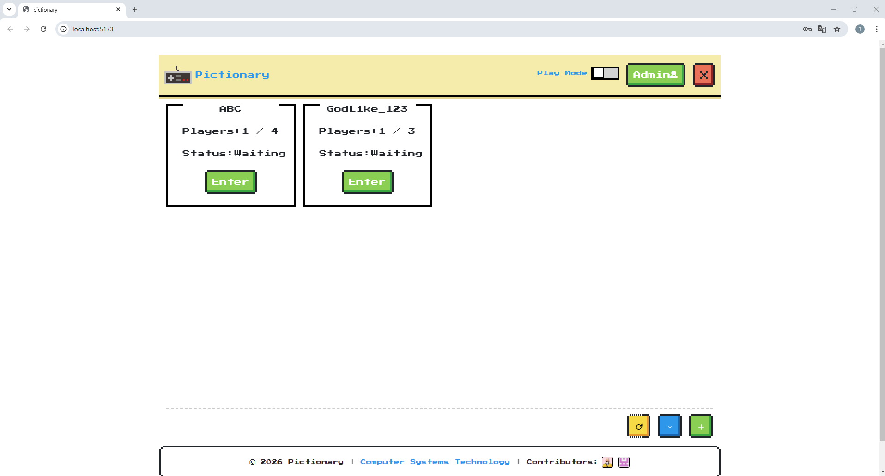
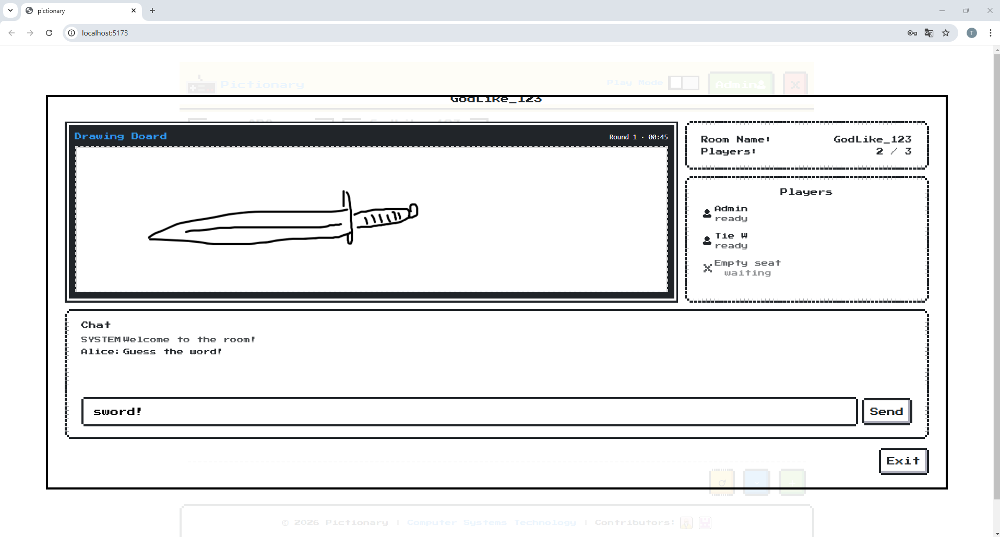

# Pictionary (Draw & Guess)

## Overview

Pictionary is a course project developed under time constraints to practice fundamental CRUD operations. The project was designed to support a simple multiplayer game concept, with the primary focus placed on frontend and backend structure rather than real-time gameplay.

## UI Screenshots

### Lobby

Lobby view showing user entry and available game rooms.

### Room

Room interface displaying basic room information after users join.

## Admin - Words Management

Admin-style interface for managing and maintaining the word list used by the game.

## Implemented Features

- User registration and authentication
- Room creation and basic room management
- Word list creation and maintenance
- RESTful APIs supporting core application workflows
- Persistent data storage using a relational database

After users enter a room, the application currently displays **static room information without interactive gameplay**. The implementation intentionally stops at this stage to remain within the scope of the original course assignment.

## Technical Focus

This project emphasizes fundamentals, including:

- Designing clear and maintainable REST APIs
- Modeling basic multi-user relationships
- Implementing CRUD operations with proper data persistence
- Structuring code for readability and future extension
- Basic Interface development by VUE 3

## Design Decisions & Scope

Due to limited course timelines, real-time gameplay features such as synchronized drawing, turn management, and live user interaction were intentionally excluded. The project prioritizes completing core functionality cleanly instead of implementing partial or rushed interactive features.

## Possible Future Improvements

One potential extension would be to support basic room interaction after users join a room. This could involve backend polling and centralized state management using tools such as Redis to coordinate shared room state across users. Implementing this properly would require a deeper understanding of backend state management and request coordination. As this goes beyond the scope of the original assignment, further development was intentionally paused.

## What I Learned

- How to build web projects incrementally within a defined scope
- How backend design choices impact future extensibility
- When to stop development to avoid over-engineering